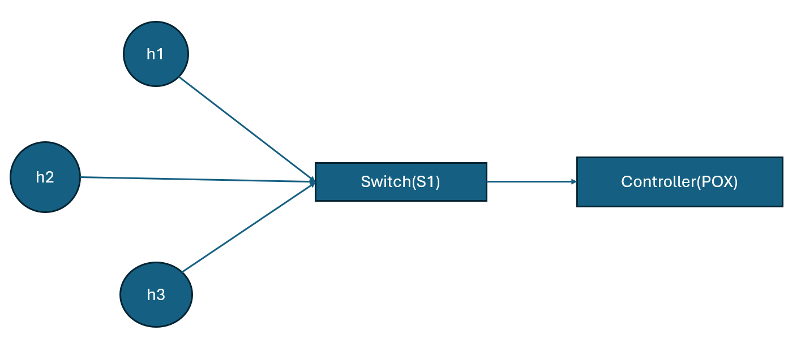
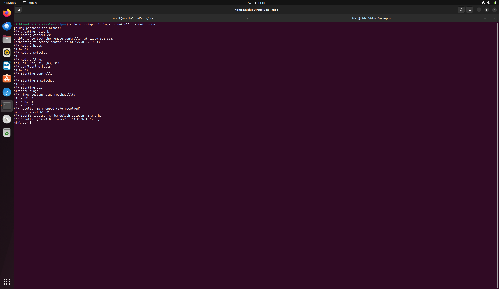
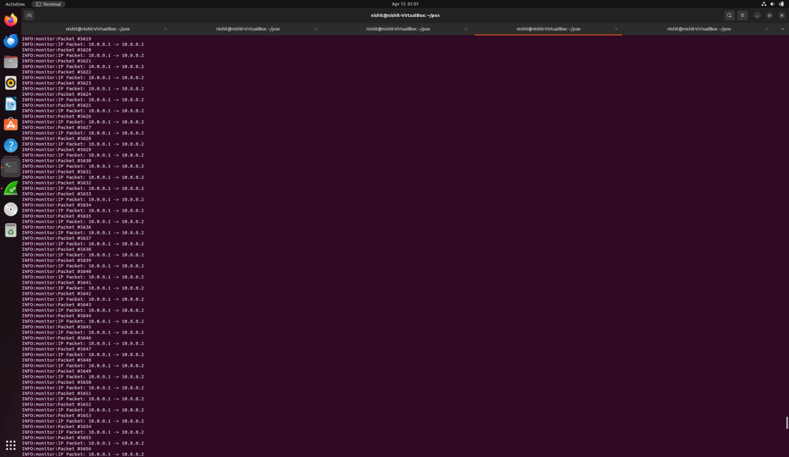
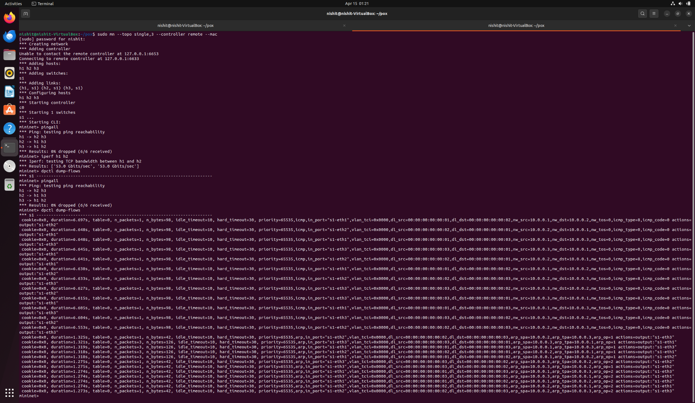
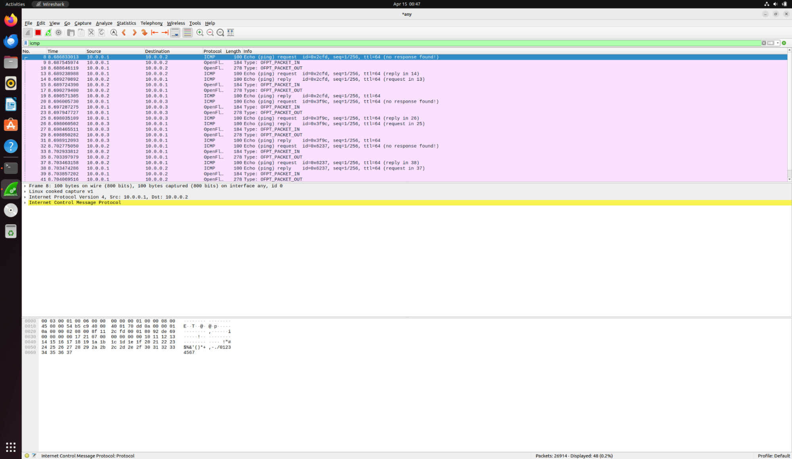
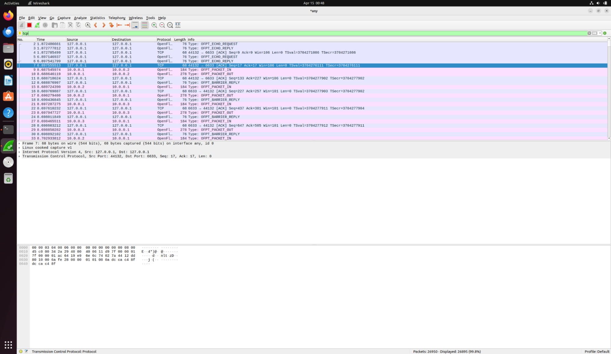

# SDN-Based Network Utilization Monitor

## 📌 Overview
This project implements a Software Defined Networking (SDN) based Network Utilization Monitor using POX controller and Mininet emulator.

The system monitors network traffic by collecting flow statistics from OpenFlow switches and estimating bandwidth usage periodically.

---

## 🎯 Objectives
- Monitor network traffic in real-time
- Collect byte counters from switches
- Estimate bandwidth utilization
- Display periodic network statistics

---

## 🏗️ Architecture
- Controller: POX
- Emulator: Mininet
- Protocol: OpenFlow
- Topology: Single switch with 3 hosts

---

## 🗺️ Network Topology

The network consists of three hosts connected to a single OpenFlow switch, which is controlled by the POX controller.

---

## ⚙️ Setup & Execution

### 1. Start POX Controller
cd ~/pox
./pox.py forwarding.l2_learning monitor

### 2. Start Mininet
sudo mn --topo single,3 --controller remote --mac

### 3. Generate Traffic
pingall
iperf h1 h2

### 4. View Flow Tables
dpctl dump-flows

---

## 📊 Expected Output

The controller periodically prints:

Requesting flow stats from switch...
Total Bytes from switch: 1302
Estimated Bandwidth: 2.08 Kbps

---

## 📸 Proof of Execution

### Mininet Output

### POX Monitoring Logs

### Flow Table Entries

### Wireshark ICMP Traffic

### Wireshark TCP Traffic

---

## 🧠 How It Works

The controller sends Flow Stats Requests every 5 seconds.
The switch responds with packet and byte counts.

Bandwidth = (ΔBytes × 8) / Time

---

## ⚠️ Note on Bandwidth Spikes

Temporary spikes in bandwidth may occur due to:
- Flow table updates
- Flow expiration
- Counter resets in OpenFlow switches

These are normal in SDN environments and do not affect functionality.

---

## 📂 Project Structure

monitor.py  
README.md  
screenshots/  

---

## 📚 References
- POX Controller Documentation  
- Mininet Documentation  
- OpenFlow Specification  

---

## ✅ Conclusion
This project demonstrates how SDN enables centralized monitoring of network traffic using controller-based analytics and flow statistics.
